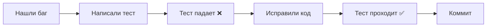

# Быстрый старт: Тестирование

## 🚀 Установка и запуск (3 шага)

### 1. Установите зависимости

```bash
npm install
```

### 2. Запустите тесты

```bash
npm test
```

### 3. Откройте UI (опционально)

```bash
npm run test:ui
```

Откроется браузер с интерактивным интерфейсом тестов.

---

## 📊 Что покажут тесты

Тесты автоматически проверят **все сценарии** с размерами нод:

### ✅ Копирование/Вставка

- Одиночные ноды
- Группы
- Трансформированные ноды
- Вырезание (Cut)

### ✅ Группировка

- Создание групп
- Трансформация групп
- Разгруппировка
- Временные группы (Shift+Click → Ctrl+G)

### ✅ Сложные сценарии

- Группировка → Трансформация → Разгруппировка → Копирование
- Вложенные группы
- Композиция трансформаций

---

## 🐛 Как тесты помогают находить баги

### Пример вывода при ошибке:

```
❌ FAIL tests/copy-paste-sizes.test.ts > должна сохранять размеры при вставке

Expected: 200
Received: 100

  at tests/copy-paste-sizes.test.ts:45:38
```

**Сразу видно:**

- Какой тест упал
- Ожидаемое значение: 200
- Полученное значение: 100
- Строка кода с ошибкой

---

## 📈 Покрытие кода

```bash
npm run test:coverage
```

Откройте `coverage/index.html` в браузере:


**Зелёные строки** = покрыты тестами  
**Красные строки** = не покрыты (потенциальные баги)

---

## 🎯 Преимущества

| Без тестов                               | С тестами                             |
| ---------------------------------------- | ------------------------------------- |
| ❌ Ручная проверка каждого изменения     | ✅ Автоматическая проверка за секунды |
| ❌ Легко пропустить edge-cases           | ✅ Все сценарии покрыты               |
| ❌ Баги находятся пользователями         | ✅ Баги находятся до релиза           |
| ❌ Страх что-то сломать при рефакторинге | ✅ Уверенность в изменениях           |
| ❌ Нет документации поведения            | ✅ Тесты = живая документация         |

---

## 🔄 Workflow разработки



**Результат:** баг больше никогда не вернётся!

---

## 📚 Дополнительно

- **Полное руководство:** `TESTING_GUIDE.md`
- **Документация тестов:** `tests/README.md`
- **Описание багов:** `BUGFIX_COPY_PASTE_SIZES.md`

---

## 💡 Совет

Запускайте `npm test` в отдельном терминале во время разработки.  
Тесты будут автоматически перезапускаться при изменении кода.

**Вы сразу увидите, если что-то сломалось!** 🎉
