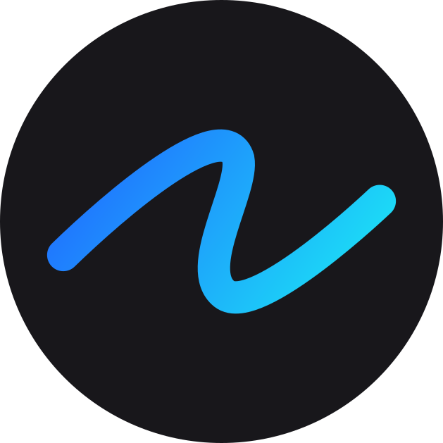

<div align="center">



# Flowscape

### A framework-agnostic 2D graphics engine for infinite canvases, editors and visual tools.

**Scenes · Nodes · Rendering · Gradients · Hit Testing · Transforms · Infinite Canvas**

`@flowscape-ui/core-sdk`

[](https://flowscape-ui.github.io/core-sdk/playground/)
[](https://flowscape-ui.github.io/core-sdk/)

<br />

[](https://www.npmjs.com/package/@flowscape-ui/core-sdk)
[](https://opensource.org/licenses/MIT)
[](https://bundlephobia.com/package/@flowscape-ui/core-sdk)
[](https://x.com/FlowscapeUI)

</div>

<p align="center">
	<a href="https://flowscape-ui.github.io/core-sdk/playground/">
		
	</a>
</p>

<p align="center">
	<strong>Click the demo to open the live Playground.</strong>
</p>

---

## Build the editor. Don't rebuild the engine.

Flowscape provides the **2D graphics, scene, rendering, and interaction foundation** behind sophisticated editor-like applications.

Build design tools, whiteboards, diagram editors, visual builders, node editors, CAD-like interfaces, and custom infinite-canvas experiences without rebuilding the same engine infrastructure every time.

**You build the product. Flowscape powers the canvas.**

---

## Engine capabilities

| Scene graph | Rendering | Interaction |
| --- | --- | --- |
| Layered scenes | Canvas renderer | Hit testing |
| Node hierarchy | Gradient paints | Selection foundations |
| Groups and transforms | Renderer abstraction | Transform overlays |
| Bounds and coordinates | Demand-driven invalidation | Pan and zoom |
| Background / World / Overlay / UI | Render-host architecture | Editor-style controllers |

<details>
<summary><strong>🎨 Paint system</strong></summary>

<br />

- Solid colors
- Linear gradients
- Radial gradients
- Conic gradients
- Diamond gradients
- Mesh gradients
- Fill and stroke rendering

</details>

<details>
<summary><strong>🧩 Built-in node types</strong></summary>

<br />

- Rect
- Ellipse
- Polygon
- Star
- Line
- Path
- Text
- Image
- Video
- Group

</details>

<details>
<summary><strong>🧭 Editor foundations</strong></summary>

<br />

- Infinite canvas camera
- Pan and zoom
- Bounds and hit testing
- Selection overlays
- Transform handles
- Layered rendering
- Renderer-independent scene state

</details>

---

## What is Flowscape?

Flowscape is a framework-agnostic 2D engine for building complex graphical applications.

It sits between low-level rendering libraries and full products, providing a reusable engine layer for scenes, nodes, transforms, rendering, interaction systems, overlays, and infinite-canvas workflows.

It is **not** a UI framework and it does not dictate how your application should look.

Your application owns the UI and product logic. Flowscape owns the graphics engine underneath it.

Flowscape is designed for products such as:

- Figma-like design tools
- Infinite canvas applications
- Whiteboards and diagram editors
- Visual and page builders
- Node-based editors
- CAD-like 2D interfaces
- Internal graphical editor tools

---

## Installation

Using Bun:

```bash
bun add @flowscape-ui/core-sdk
```

Using pnpm:

```bash
pnpm add @flowscape-ui/core-sdk
```

Using npm:

```bash
npm install @flowscape-ui/core-sdk
```

Using Yarn:

```bash
yarn add @flowscape-ui/core-sdk
```

---

## Quick Start

Create a container:

```html
<div id="app"></div>
```

Give it a visible size:

```css
html,
body,
#app {
	width: 100%;
	height: 100%;
	margin: 0;
}
```

Then create a scene:

```ts
import {
	Scene,
	LayerBackground,
	LayerWorld,
	LayerOverlay,
	RendererLayerBackgroundCanvas,
	RendererLayerWorldCanvas,
	RendererLayerOverlayCanvas,
	CanvasRendererHost,
	NodeRect,
} from "@flowscape-ui/core-sdk";

const container = document.getElementById("app");

if (!container) {
	throw new Error("Container #app not found");
}

const scene = new Scene(container.clientWidth, container.clientHeight);

const background = new LayerBackground();
const world = new LayerWorld();
const overlay = new LayerOverlay(world);

scene.addLayer(background);
scene.addLayer(world);
scene.addLayer(overlay);

scene.bindLayerRenderer(background, new RendererLayerBackgroundCanvas());
scene.bindLayerRenderer(world, new RendererLayerWorldCanvas());
scene.bindLayerRenderer(overlay, new RendererLayerOverlayCanvas());

const host = new CanvasRendererHost(container, -1);
scene.addHost(host);

background.setFill("#101010");

const rect = new NodeRect(1);
rect.setPosition(300, 220);
rect.setSize(220, 140);
rect.setFill("#3b82f6");

world.addNode(rect);
scene.invalidate();
```

For input controllers, selection, transformations, camera controls, and advanced editor workflows, see the [documentation](https://flowscape-ui.github.io/core-sdk/).

---

## Usage

### ES Modules

```ts
import {
	Scene,
	NodeRect,
	LayerWorld,
	CanvasRendererHost,
} from "@flowscape-ui/core-sdk";
```

### Browser Script

Flowscape can also be used directly in the browser without a bundler.

```html
<script src="https://unpkg.com/@flowscape-ui/core-sdk/dist/flowscape.global.js"></script>

<script>
	const scene = new Flowscape.Scene(1280, 720);
</script>
```

The standalone build exposes the public API through the global `Flowscape` object.

```js
const rect = new Flowscape.NodeRect(1);
```

---

## Architecture

Flowscape separates **scene state**, **rendering**, and **interaction logic**.

```text
                         Flowscape
                            │
              ┌─────────────┼─────────────┐
              │             │             │
            Scene          Nodes       Controllers
              │             │             │
            Layers       Transform       Input
              │             │             │
              └─────────────┼─────────────┘
                            │
                       Renderer API
                            │
                       Canvas backend
                            │
                          Browser
```

The scene is organized into dedicated layers:

```text
Scene
├── Background Layer
├── World Layer
│   └── Nodes
├── Overlay Layer
│   └── Handles / Selection / Transformations
└── UI Layer
```

This separation allows rendering implementations to evolve without requiring editor-level product logic to be rewritten.

---

## Why Flowscape?

Most canvas libraries provide rendering primitives.

Flowscape aims to provide the **engine layer above those primitives**.

Instead of rebuilding the same infrastructure for every graphical product, developers can start with reusable foundations for:

- scene organization
- node hierarchy
- coordinate systems
- camera behavior
- rendering
- hit testing
- selection
- transformation
- interaction systems
- editor overlays

Flowscape is closer in philosophy to an engine for graphical applications than to a component library or ready-made editor.

---

## Repository Structure

Flowscape is developed as a Turborepo monorepo.

```text
flowscape/
├── apps/
│   ├── docs/
│   └── playground/
│
├── packages/
│   └── engine/
│
├── package.json
├── turbo.json
└── bun.lock
```

### `apps/docs`

The Flowscape documentation application.

### `apps/playground`

The interactive development environment and public engine showcase.

### `packages/engine`

The core Flowscape engine, published as:

```text
@flowscape-ui/core-sdk
```

---

## Development

Flowscape uses Bun, Turborepo, TypeScript, and tsdown.

Clone the repository and install dependencies:

```bash
bun install
```

Run the Playground:

```bash
bun run dev:playground
```

Run the documentation:

```bash
bun run dev:docs
```

Build the monorepo:

```bash
bun run build
```

Run type checking:

```bash
bun run typecheck
```

Run linting:

```bash
bun run lint
```

More information about contributing can be found in [`CONTRIBUTING.md`](./CONTRIBUTING.md).

---

## Public API Policy

Applications should import Flowscape exclusively through the public package API:

```ts
import { Scene, NodeRect } from "@flowscape-ui/core-sdk";
```

Do not import internal modules directly:

```ts
// ❌ Do not do this
import { Scene } from "@flowscape-ui/core-sdk/src/scene";
```

Internal project structure may change between releases.

Only exports available through `@flowscape-ui/core-sdk` should be considered part of the public API.

---

## Project Status

Flowscape is under active development.

The architecture and internal implementation continue to evolve as the engine expands toward more advanced rendering, interaction, and editor systems.

Public API stability is treated as a priority, but major releases may introduce intentional breaking changes when necessary for the long-term architecture of the engine.

See [`CHANGELOG.md`](./CHANGELOG.md) for release history.

---

## Links

- [Documentation](https://flowscape-ui.github.io/core-sdk/)
- [Playground](https://flowscape-ui.github.io/core-sdk/playground/)
- [npm Package](https://www.npmjs.com/package/@flowscape-ui/core-sdk)
- [GitHub Issues](https://github.com/Flowscape-UI/core-sdk/issues)
- [Changelog](./CHANGELOG.md)

---

## Contributing

Contributions, bug reports, and feature proposals are welcome.

Before contributing, please read [`CONTRIBUTING.md`](./CONTRIBUTING.md).

For bugs and feature requests, use the project's GitHub Issues.

---

## Authors

See [`AUTHORS.md`](./AUTHORS.md).

---

## Support Flowscape

Flowscape is developed as an open-source project.

If Flowscape is useful to you or your team, you can support its continued development.

[❤️ Sponsor Flowscape](https://github.com/sponsors/Flowscape-UI)

---

## License

Flowscape is released under the [MIT License](./LICENSE).

© Flowscape UI Team
